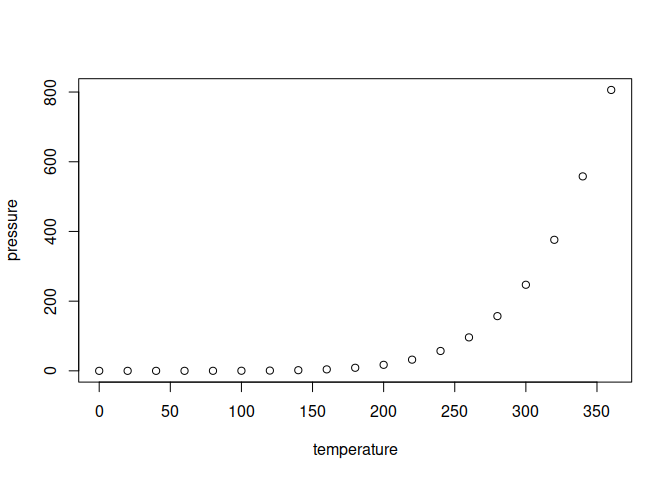

Application of the Box-Cox transformation in valuation
================
Cyrill A. Murashev,
2022-10-30

## Abstract

The ability to work with numerical data is an essential skill for an
appraiser. Price or cost per object or unit (e.g. square meter or foot,
lot, etc.), area, power, mileage, chronological age, and more are all
measured numerically. Appraisers work with numbers all the time.
Recently, there has been a trend toward more evaluations using
mathematical apparatus, methods of mathematical statistics, and machine
learning. Today, appraiser more often use a frequentist approach to
probability rather than a Bayesian approach. In this regard, they are
often faced with the following problem. Many statistical tests and
methods assume a normal distribution of data. But the economic data that
appraisers usually deal with are most likely to have a distribution
other than normal. This poses a definite problem. The purpose of this
paper is to give appraisers a tool to overcome this problem. The Box-Cox
transformation in many cases allows you to transform the data in such a
way that their distribution is normal. This will allow you to apply
parametric methods. This paper consists of three parts. The first
contains a general theoretical description of the method. In the second,
we will apply the basic method implementation to the data of residential
real estate in Almaty. The third part will focus on some of the more
difficult practical issues, in particular, we will consider the
possibility of applying a two-parameter transformation model. I used the
R language to write this paper. The use of Python to perform the Box-Cox
transformation is discussed in a later paper.

## General description

# The concept of Power transform

You can include R code in the document as follows:

``` r
summary(cars)
```

    ##      speed           dist       
    ##  Min.   : 4.0   Min.   :  2.00  
    ##  1st Qu.:12.0   1st Qu.: 26.00  
    ##  Median :15.0   Median : 36.00  
    ##  Mean   :15.4   Mean   : 42.98  
    ##  3rd Qu.:19.0   3rd Qu.: 56.00  
    ##  Max.   :25.0   Max.   :120.00

## Including Plots

You can also embed plots, for example:

<!-- -->

Note that the `echo = FALSE` parameter was added to the code chunk to
prevent printing of the R code that generated the plot.
